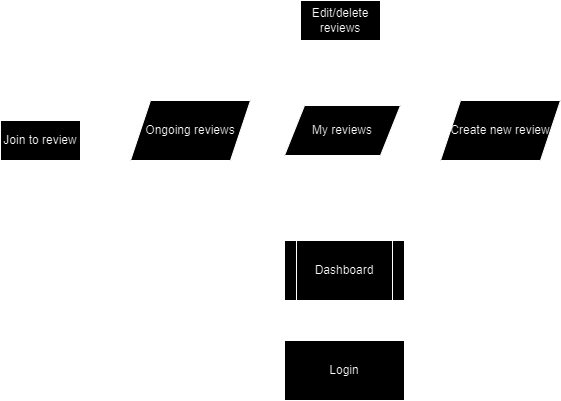
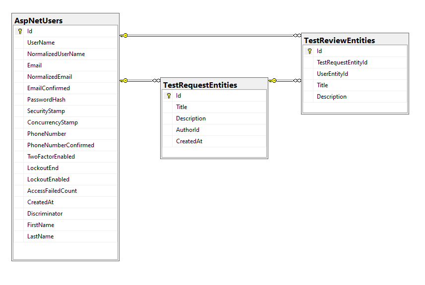

# TestingLab

<h1>Opis aplikacji</h1>

Strona służaca do **publikowania otwartych testów i otrzymywania informacji o błędach aplikacji mobilynych**. Użytkownicy mogą publikować aplikacjie, które będą testowane przez innych.

## Platforma umożliwia:

* Publikowanie Aplikacji
    - Wgraj plik APK lub IPA swojej aplikacji.
    - Podaj informacje o aplikacji, takie jak nazwa, opis, kategoria i wymagania systemowe.

* Testowanie Aplikacji
    - Pobierz i zainstaluj aplikacje innych użytkowników na swoim urządzeniu.
    - Przetestuj aplikację pod kątem błędów i problemów.
    - Wyślij raporty o błędach, zawierające szczegółowy opis problemu.

* Przeglądać raporty o błędach
    - Zobacz listę zgłoszonych błędów dla każdej aplikacji.
    - Przeczytaj opisy błędów.
    
## Aplikacja jest napisana w C# ASP.NET i oferuje następujące funkcje:

* Łatwy w użyciu interfejs użytkownika.
* Szczegółowy system raportowania błędów.
* Możliwość śledzenia i zarządzania błędami.

## Korzyści z korzystania z aplikacji:

* Znajdź i napraw błędy w swojej aplikacji przed jej wydaniem.
* Uzyskaj cenne informacje zwrotne od innych użytkowników.
* Zwiększ jakość swojej aplikacji i zapewnij lepsze wrażenia użytkownikom.

## Aplikacja jest idealna dla:

* Deweloperów aplikacji mobilnych
* Testerów oprogramowania
* Użytkowników, którzy chcą pomóc w testowaniu aplikacji i zgłaszaniu błędów

Otwórz aplikację już dziś i zacznij dodawać swoje projekty oraz testować aplikacje innych!

<h1>Diagram widoków</h1>

<h1>Diagram bazy danych</h1>

